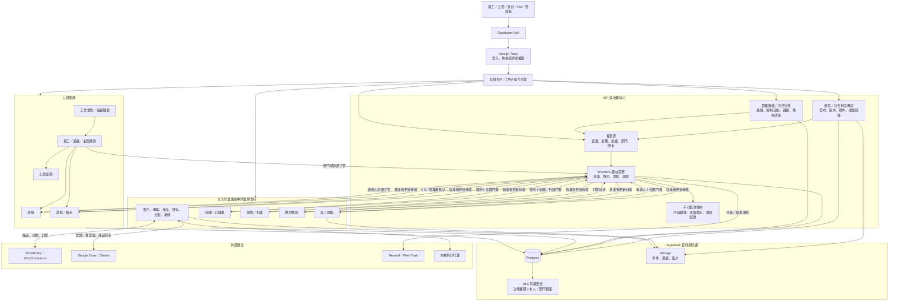

# 光輝系統整合架構圖

## 主要連結規則

- 規章／公告是制度來源；權責表是 Workflow 的可執行規則，不另建第二套簽核設定。
- Workflow 以表單類別、金額、折讓比例、申請部門及直屬主管決定關卡；找不到有效流程時拒絕送簽，不再自動核准。
- 報價、採購、報銷、請假、薪資與應付帳款沿用原始業務單據，只增加簽核狀態與簽核實例，不複製主檔。
- 送簽後鎖定主檔與明細；核准時重新比對內容雜湊，避免送簽後被竄改。
- HR 的員工、部門與直屬主管資料直接提供 Workflow 路由；管理循環則保存控制活動、查核證據與改善追蹤。
- 前端功能權限、API 權限與資料庫 RLS 三層共同控管；外部 webhook、公開簽收與列印代理使用獨立密鑰／token。

## 實作位置

- 介面：`src/app/(dashboard)/eip`、`approvals`、`internal-control`、`expense-claims`、`hr`
- 流程 API：`src/app/api/approvals`
- 流程邏輯：`src/lib/approvals-server.ts`
- 登入與 API 閘門：`src/proxy.ts`
- 資料庫：`supabase/migrations/20260909131300_integrate_eip_workflow_internal_controls.sql`
- 安全強化：`supabase/migrations/20260910001047_harden_api_workflow_and_rls.sql`
